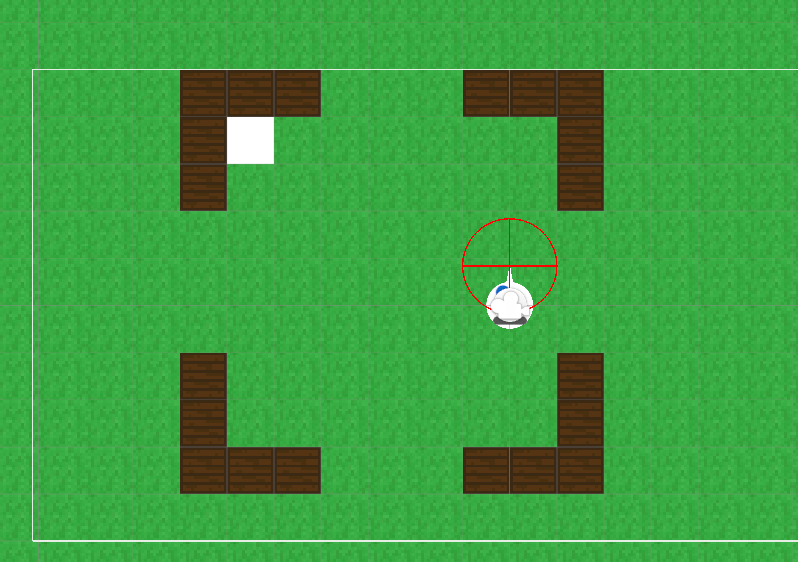
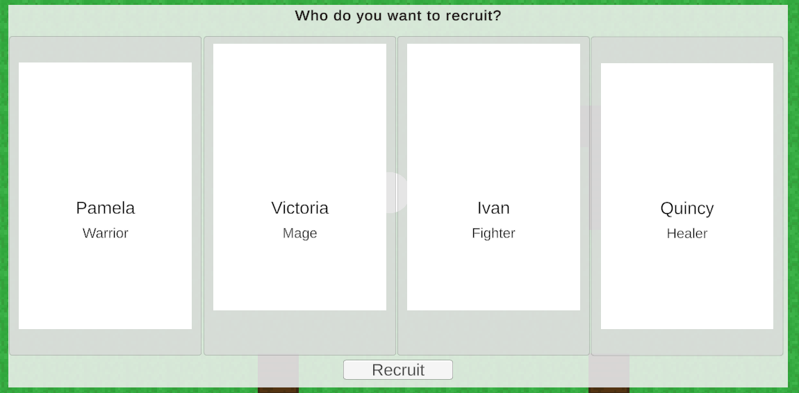

# Developer Blog 1 - Game Development Course

## Introduction

The current state of the game is a simple 2d top down game with a player character that can move around. Use "Interact" to interact with a recruitment table. And then i have made some game logic around randomly generating characters to choose from. With UI to actually make the choice.

Note: The UI is very much so not final, and will very likely be changed in the future.

## Movement system

Currently i am using the newer Input System package from Unity. It is a bit more complex than the old Input Manager, but it is also a lot more powerful. It is also a lot more flexible, and it is easier to add new input devices. Which i think is a good thing to learn. However this might not be the best choice for a small project, since it has also proven troublesome to find good documentation / coding examples / tutorials using the new input system in more complex scenarios. (Which also is a topic i will talk about later)

## Worldbuilding

The world right now is a simple 2d top down world. I have made a simple tilemap, and i have made a simple system for layers. Where one layer acts as a "background" for grass, dirt, etc. And another layer acts as a "colission" layer, such as walls. In order to place actual objects in the world. I am currently just dragging gameobjects into the scene, carefully placing them into the right position, and then setting them to the right layer. This is a very manual process, and i am currently looking into ways to automate this process. To somehow make the worldbuilding more natural, less manual, and make it seamless with the tilemap.

## In-game UI

I have made a simple UI for the recruitment table. It is very simple, and it is very much so not final. But it is a start. I have made a simple system for generating characters. Using "ClassBlueprints", that has different "ranges" of stats that can be rolled. However the UI itself i am not happy with. I am currently looking into other ways of making the UI. Looking into topics such as "ScriptableObjects" and "Databinding". But it is quite hard to find good coding examples of this.

## Trying to figure out good design principles

When coding, i am trying my best to adhere to the best principles. Whenever i am trying to solve a task. I use most of my times with google, and chatbots (mostly googles' Gemini chatbot at the moment). To find out what my options are, at for example creating UI or randomizing stats.

It is quite easy to find different solutions on youtube for examples. But there are a lot of different ways to solve most the problems. So it is quite hard to find the "best" or even just a "better" solution to my problems. so most of my time is actually spent trying to backtrace the different solutions, and trying to figure out what the best solution is. Which leads me to my next point.

## Trying to prioritize the right things

As mentioned, i have been prioritizing making "perfect" code, instead of making "working" code, and then moving on. Which, motivationally speaking. Hasn't been a good choice for me. As i see people around me reach the point of "it works", and then they move on. Which has meant that many are "further" into the game process than me. While i stay behind, trying to make the "perfect" code.

This is definitly something i am going to change in the future. To keep myself motivated for the game. Also, i will try to be more thorough in my research, to find the best solution to my problem, before actually starting somehing.

## Conclusion

I have learned a lot of new things, and i have made a lot of progress. But i have also learned that i need to change my approach to the project. I need to be more thorough in my research, and i need to be more focused on making "working" code, instead of "perfect" code. I also need to be more focused on making the game, instead of making the "perfect" game. I am only a single person, and i have a limited amount of time. So i need to prioritize the right things.

## Next steps

- Looking into Scriptable objects and Databinding
- Looking into ways to improve the worldbuilding
- Looking into ways to make the UI more dynamic and flexible

## Acknowledgements

- Unity is hard!
- It's easy to find simple examples, it is impossible to find complex examples!
- I need to be more focused on making the game, instead of making the "perfect" game.
- Maybe it is a good idea to ask the other students about their solutions to the common problems such as UI, Worldbuilding, Health, etc.
