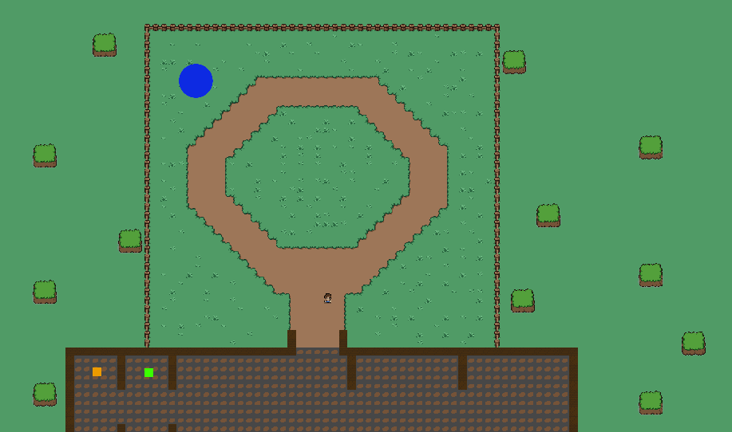

# Developer Blog 1 - Game Development Course

Have guildmembers be able to move around in the world, expand upon the tavern. Send guildmembers to dungeons.

## State of the game

Currently the game is looking like the below picture, a small arena where there will be space for portals to be summoned. The player now has animation and is able to interact to both the "Recruitment Table" to "hire" new guildmembers. And a newly added "Shop table" that currently only has UI implemented.

There has been remade logic for creating the characters, Portal spawning logic and animation of the character.

## New Tileset

In my opinion the previous tileset looked very cheap and not so lively, so i found another tileset online that also had some animation and a character the fit nicely.
So i decided to change the tileset to this one. During this change, i also changed the 'map' to have a tavern near the bottom of it, to make it larger and have space for possible logic for guildmembers running around.

### Making a tavern

As a quite important aspect of being a guildmaster, you need the tavern. As mentioned i wanted the tavern to be in the bottom of the map, so that there is space for lots of guildmembers running around. To make the game feel lively.

When implenting the tavern i used a seperate tilemap for it, so that i could seperate the logic and layers of the "Outside World" and the "Tavern". So they have their own Grid's and Tilemaps. This way it is not "hardcoded" where the tavern is. And could in theory be moved to another location in the future. (Thinking of a "Where would you like to be located? feature.)

## Animation

As mentioned before the Sprite package i found alread had some animation within it. So i decided to add animation to the character from here. Since it felt very important in a not so polished game 😅. Currently the animation is limited to only movement, since there is not yet a usecase for "Attacking" or "Dying" in the game.

An Intesting thing i found out about the animation, was that when i wanted to decide between which sprite i could use when going "Top" and "Right" at the same time. Then i had the opportunity to use prioritze the "Right" animation. By changing these values in the "Animator" window.

There were also animation sheets for enemies such as slimes. I have implemented these, but are currently not using them. I thought i would be able to, but i have not yet reached the "Monsters Leave the dungeon and attack the tavern" usecase.

## Rethinking the UI (Again 😪)

When working on making dynamic UI, i found that it was very hard and challenging to work with. It also seemed weird that every single feature within my game was a "UI" of some sort. So i would be walking around in a 2d world, opening UI in different places.

When i got the idea for my game, i looked at for example "Shakes and Fidget" for inspiration. Which is entirely UI based in a browser.

I then decided to move the "Entirely UI" part of the game. So i would walk around in a world. But now every single feature is a "UI" anyway. So have i really "Removed" the UI from the game? 🤔

I decided that i haven't. And even though i have it under "Would be nice" usecases.
I would really want to remove all UI from the game, and make it entirely world based. For example i would like for the Recruitment table to be a "Line of people". Where actual characters could walk in, with some glowing colors around them to display their rarity. And then you could walk up to them and "Recruit" them.

And the Shop could become a similar thing, where a shopkeeper would put new items on a table for the player to see. Kind of like this shop in "Risk of Rain 2".

I think this would make the game feel more alive, and less like a "Clicker" game. But as mentioned, i sadly dont have time to rework the UI i have already made. So i will only be able to do this if i have time left at the end of the project.

I will however try to implement all features without UI from now on.

## Finding Motivation

As mentioned in the previous blog, i have been struggling with motivation. And i have been trying to find ways to keep myself motivated. I have found that the best way to keep myself motivated is to keep the game "fun". And to keep the game "simple". This is still a school project, and i am only a single person. So i need to keep the game simple, and i need to keep the game fun.

It has however not helped with my anxiety to see other students "further" in the project than me. But i have to keep reminding myself that i am only a single person, and i have a limited amount of time. So i need to prioritize the right things.
