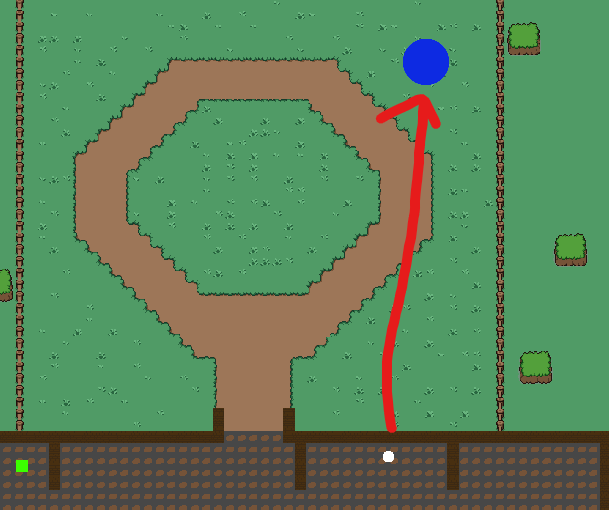

Expand upon dungeon system, have completede dungeons grant gold, make recruitments cost gold. And implement game logic for a round system.

# Developer Blog 3 - Game Development Course

## Making the Guildmembers move

Initially i tried to use the "NavMesh" system in Unity. But that never ended up working, so i decided to make my own movement system. Which is quite simple. I just made a "MoveTo" function.

I am not sure about why the NavMesh didn't work. But whenever i baked the NavMesh, and spawned the guildmembers. It would just stand still. And give the error

**_"Failed to create agent because it is not close enough to the Navmesh"._**

Which was very odd, and took quite some time for me to look into. Thinking about my "Keep moving forward" principle, i decided to just make my own movement system. And then move on. Which means that the guildmembers will now just move like this



This is something that i am very much not happy about, and i will look into fixing this in the future. But for now, i will move on.

## Actually completing the dungeon

Having implemented the dungeon system, i now needed to actually make it possible to complete the dungeon. This was implemented in a quite quick looping manner. So that i can spend more time on finishing the gameplay loop.

The code for completing the dungeon, and which i am very much not happy about. Looks like this:

```csharp
private void Update()
{
    // List to store portals for removal
    List<PortalProgress> portalsToRemove = new List<PortalProgress>();

    // Check if any guildmembers are inside the portals
    foreach (var portal in ActivePortals)
    {
        if (portal.GuildmembersInside.Count > 0)
        {
            // Handle logic for guildmembers inside portal
            portal.Progress++;

            if (portal.Progress >= 100)
            {
                // Add portal to removal list
                portalsToRemove.Add(portal);

                // Remove guildmembers from the portal
                foreach (var guildmember in portal.GuildmembersInside)
                {
                    guildmember.SetActive(true);
                    guildmember.GetComponent<GuildMemberController>().BeginWalking();
                }

                // Remove the portal gameobject
                GetComponent<AudioSource>().Play();

                PortalSpawner.RemovePortal(portal.PortalData.Position);

                Debug.Log("Portal at " + portal.PortalData.Location + " has been completed!");
            }
        }
    }

    // Remove portals marked for removal after the loop
    foreach (var portal in portalsToRemove)
    {
        ActivePortals.Remove(portal);
    }

    // Check if all portals are completed (optional, can be moved elsewhere)
    if (ActivePortals.Count == 0)
    {
        Debug.Log("All portals have been completed!");

        // Start the next round
        GameManager.Instance.NextRound(); // Could also be subscribed to the DungeonCleared event

        DungeonCleared?.Invoke(); // Trigger DungeonCleared event for giving gold
    }
}
```

This is very embarrasing to show as the code is very much the opposite of what i would call good code, but because of time pressure, i will move on. And then come back to this later.

If i however had the time to implement this properly. I would probably do the following:

- Make a "Portal" class that would handle the logic for the portal - Such as "How much progress has been made" and showing a progress bar, also recording which guildmembers are inside the portal.

## Implementing the round system

Finally, i have waited so long with actually having to implement something that didn't take too long. When implementing the round system, all i have had to do was to create a singleton GameManager class. Where i would be able to control the game.
This started off with the rounds being implemented.

```csharp
public void StartGame()
{
    RoundNumber = 1;

    PortalManager.InitiatePortals(RoundNumber);
    Debug.Log("Game has started!");
}

public void NextRound()
{
    RoundNumber++;

    RoundCounter.NextRound(RoundNumber);

    PortalManager.InitiatePortals(RoundNumber);
    Debug.Log("Round " + RoundNumber + " has started!");
}
```

Quite simple, also incrementing the round number on the roundCounter. That will display the round on the screen.

You can also notice that i connected the GameLogic to a PortalManager. That now has some logic for initiating the portals. Like so:

```csharp
public void InitiatePortals(int roundNumber)
    {
        // Clear the list of active portals
        ActivePortals.Clear();

        int numPortalsToSpawn;

        // Define logic based on round number ranges
        if (roundNumber >= 1 && roundNumber <= 2)
        {
            numPortalsToSpawn = 1;
        }
        else if (roundNumber >= 3 && roundNumber <= 4)
        {
            numPortalsToSpawn = 2;
        }
        else if (roundNumber >= 5 && roundNumber <= 6)
        {
            numPortalsToSpawn = 3;
        }
        else if (roundNumber >= 7 && roundNumber <= 8)
        {
            numPortalsToSpawn = 4;
        }
        else
        {
            numPortalsToSpawn = 5;
        }

        // Spawn portals
        for (int i = 0; i < numPortalsToSpawn; i++)
        {
            // Choose a random portal location from the list
            int randomIndex = Random.Range(0, PossiblePortals.Count);
            Vector2 spawnPosition = PossiblePortals[randomIndex].Position;

            // Store the portal data in the ActivePortals list
            ActivePortals.Add(new PortalProgress(PossiblePortals[randomIndex]));

            // Spawn the portal at the chosen position
            PortalSpawner.SpawnPortal(spawnPosition);
        }
    }
```

Smooth setup! Loved it! For the first time in a long time i experience saying "I Need this". And then it only took me 30 minutes to implement. So happy!!

## Stuff costs gold! And stuff grants gold!

I needed a gold system. Since it needs to cost something to hire new guildmembers, and likewise, the player needs to be able to earn gold. So i implemented a very simple gold system. That would be able to handle this.

So i implemented a gold counter for the player. And then i made sure that whenever a dungeon was cleared, the following method would be called.

```csharp
private static void OnDungeonCleared()
    {
        //Add gold to the user
        int minGold = 10;
        int maxGold = 30;
        int gold = UnityEngine.Random.Range(minGold, maxGold);
        _Instance.GoldCounter.AddGold(gold);
    }
```

Relatively simple. And quick solution, later on in the system. It should probably take into account the:

- Round Number
- Difficulty of the dungeon - could be a simple affix system
- How quick the dungeon was taken down?

But for now, this is a good solution. And i will move on.

Also, i made sure that the recruitment of new guildmembers would cost gold. So i implemented a simple method for this.

```csharp
 private void HandleMemberSelection(GuildMemberData guildMember)
{
    // Check gold and potentially call BuyCharacter here
    if (_goldCounter.CanBuy(10))
    {
        OnRecruit?.Invoke(guildMember);
        _goldCounter.SpendGold(10);
    }
    else
    {
        Debug.Log("Not enough gold");
    }
}
```

Currently it just takes 10 gold to get a new guildmember. But this could be expanded upon in the future.

It should probably take into consideration:

- The rarity of the guildmember
- How good the stats are.
- The round number? (Bigger numbers = sense of progression)

## Expanding on the Guildmember Generation

I also expanded upon the guildmember generation. To actually use "Blueprints" for the guildmembers. So that they will have defined "Ranges" for their stats. This is quite simple, and i will show the code for this below.

```csharp
using Common;
using Common.Utils;

namespace Interactables.Recruitment
{
    public class ClassBlueprint : Enumeration<ClassBlueprint>
    {
        public Range<int> Physical { get; set; } // Using Range<int> for stat ranges
        public Range<int> Magical { get; set; }
        public Range<int> Health { get; set; }

        public Range<int> MovementSpeed { get; set; }

        public ClassType ClassType { get; set; }

        public static readonly ClassBlueprint Warrior = new ClassBlueprint(
            0,
            "Warrior",
            ClassType.Warrior,
            new Range<int>(30, 40), //Physical
            new Range<int>(10, 30), //Magical
            new Range<int>(180, 220), //Health
            new Range<int>(5, 8)); //MovementSpeed

        public static readonly ClassBlueprint Mage = new ClassBlueprint(
            1,
            "Mage",
            ClassType.Mage,
            new Range<int>(10, 30),
            new Range<int>(40, 60),
            new Range<int>(120, 160),
            new Range<int>(2, 4));

        public static readonly ClassBlueprint Assassin = new ClassBlueprint(2
        ,
        "Fighter",
        ClassType.Assassin,
            new Range<int>(50, 70),
            new Range<int>(30, 50),
            new Range<int>(80, 120),
            new Range<int>(6, 10));

        public static readonly ClassBlueprint Healer = new ClassBlueprint(
            3,
            "Healer",
            ClassType.Healer,
            new Range<int>(20, 40),
            new Range<int>(20, 40),
            new Range<int>(140, 180),
            new Range<int>(4, 6));

        public static readonly ClassBlueprint[] Classes = { Warrior, Mage, Assassin, Healer };

        protected ClassBlueprint(int value, string name, ClassType classType, Range<int> physical, Range<int> magical,
            Range<int> health, Range<int> movementSpeed) : base(value, name)
        {
            Physical = physical;
            Magical = magical;
            Health = health;
            ClassType = classType;
            MovementSpeed = movementSpeed;
        }
    }

    public enum ClassType
    {
        Warrior,
        Mage,
        Assassin,
        Healer
    }
}
```

I think this is pretty neat, and makes it easily expandible in the future. I am quite happy about it.
