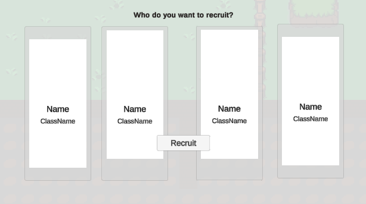
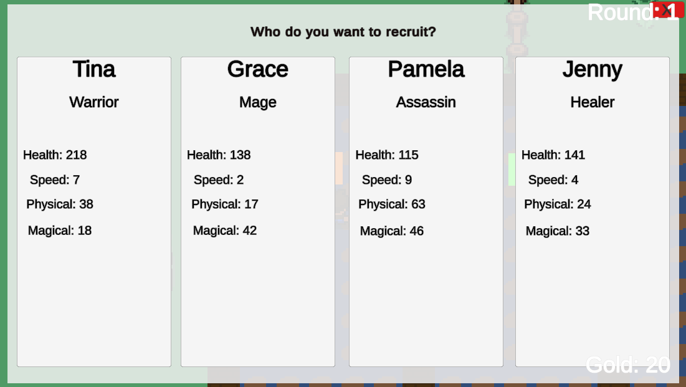

## Old UI needed to be updated

Old UI was structured around working with mouse clicking. So i had tonnes of classes that were actually handling these mouse events. And using "Highlighting" Controllers to actually show the user what he is clicking on. Afterwards he would be able to click "Recruit" to actually recruit the clicked Guildmember. This is what it looked like:

It was setup basically like this in the code:

It was a mess, and by dirtly adding on click methods that would do lots of different stuff for each option. And lots of looping over child entities and stuff. It wasn't pretty!

Since it has to be playable with a controller, i found out that i was able to change these into buttons. That Unity has a built in system for handling these buttons. So i changed the UI to look like this:

With this new system, i actually required a lot less code to make it work. And it has now has the ability to navigate with the controller!

## Concluding the project

The project has has been a great learning experience. The end result are as follows:

- A working game with a somewhat full gameplay loop (It's only missing the ending).
- A titlescreen, with multiple different scenes.
- A working UI that can be navigated with a controller.

---

The final gameplay loop is this

1. Start the game, Pick "Play"
2. Able to run around, preferably to the Tavern
3. On the Left-side most table, you can recruit Guildmembers - This uses it's own guildmember creation system to create new guildmembers.
4. Guildmembers will walk around inside of a designated area in the tavern.
5. Interact with the guildmembers to send them to dungeons.
6. When dungeons have all been cleared, a new round will start. And new dungeons will spawn. - Clearing dungeons will grant gold to the player.
7. Repeat until you're bored. (Damn, this part feels like it's missing something)

---

Yea, that's the final gameplay loop, it's not much. But it's something.

I am very much not happy about it. I feel like i could have done so much more. But i'm also happy that i was able to finish it. I've learned a lot about Unity and C# in the process. And i'm happy about that.

This is something i touch more upon in the reflection page.

### Working with Unity

Working with unity has been a great experience. I've learned a lot about how to work with the engine. And how to solve problems that arise.

I've learned how to work with the UI system, and ended up being quite OK at it.
What i felt that i was actually pretty good at was probably the code specific problems. Such as the round system, and the Guildmember system.

Using the different systems in Unity for example The NavMesh system (that i got to work in the assignments, but not in the final project). The animation system, building everything with components and prefabs.

### What i wish i could've implemented / had more time for / if i were multiple people

There are so many things i could be putting onto this list. But i'll try to keep it short.

- **Expanding the Dungeons**

I never got to the part where i could expand upon the dungeons and give them affixes. So that the dungeons would be more interesting to play. Also adding progression bars to the dungeons, to see how far you've gotten within them.

- **More Guildmember Interactions**

Currently you only press 'E' (on keyboard) to send them to dungeons. I would've liked to have more interactions with them. Such as talking to them, and telling them which dungeons to go to.

- **Being able to lose the game**

Currently you can't lose the game. You can't even finish it, actually. This is something that i would've really much liked to have had time to implement. The plan was to have monsters attack the tavern, when the "timer" for the dungeon ran out. And if you didn't have enough guildmembers to defend the tavern, you would lose.
I already had some monster animations in place for this, but i didn't get around to implement them.

## Conclusion

Being a single person for this project, i still had hoped i got more done. But i'm happy with what i've done. I've learned a lot about Unity and C# in the process. And i'm happy about that.
