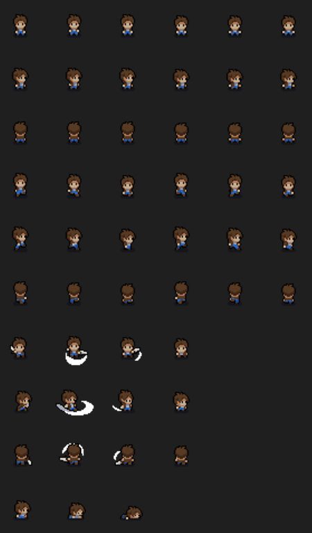
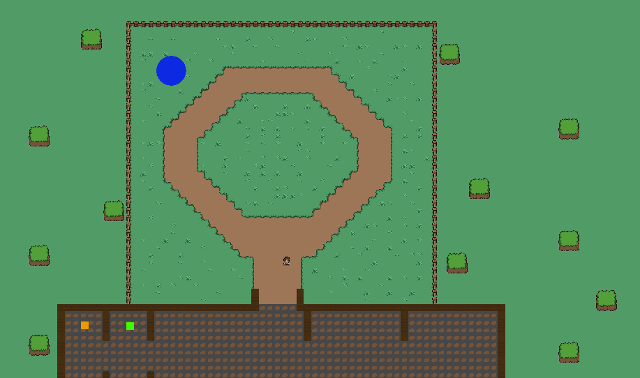

# Reflections

## Reflection on the end result

As talked about in the previous devblogs, i have been struggling with motivation. And i have been trying to find ways to keep myself motivated. I have found that the best way i could do this was to try and keep moving forward, even though the existing solution may not have been perfect. This was however after i had already spent lots of time trying to perfect the movement, grid system and the first iterations of UI. This was a mistake, and i should have moved on to the next task, and then come back to the previous task if i had time left. This would have kept me motivated, and i would have been further in the project than i am now.

Lot's of the code that i have written is not perfect. It has been pretty time pressured to actually try to complete the gameplay loop. So many of the solutions on the last few sprints may not have been my best work. For example i have these cases:

**The Portal Closing system**

The portal closing system is really only a loop that is run within the Update function. Very much not optimized, very quick, ugly and dirty. And honestly i hate it. But it works. And it was the best solution i could come up with in the time i had. I would have loved to make a more elegant solution. Which i have talked about in a previous devblog (Devblog_3). This is the code:

```csharp
private void Update()
{
    // List to store portals for removal
    List<PortalProgress> portalsToRemove = new List<PortalProgress>();

    // Check if any guildmembers are inside the portals
    foreach (var portal in ActivePortals)
    {
        if (portal.GuildmembersInside.Count > 0)
        {
            // Handle logic for guildmembers inside portal
            portal.Progress++;

            if (portal.Progress >= 100)
            {
                // Add portal to removal list
                portalsToRemove.Add(portal);

                // Remove guildmembers from the portal
                foreach (var guildmember in portal.GuildmembersInside)
                {
                    guildmember.SetActive(true);
                    guildmember.GetComponent<GuildMemberController>().BeginWalking();
                }

                // Remove the portal gameobject
                GetComponent<AudioSource>().Play();

                PortalSpawner.RemovePortal(portal.PortalData.Position);

                Debug.Log("Portal at " + portal.PortalData.Location + " has been completed!");
            }
        }
    }

    // Remove portals marked for removal after the loop
    foreach (var portal in portalsToRemove)
    {
        ActivePortals.Remove(portal);
    }

    // Check if all portals are completed (optional, can be moved elsewhere)
    if (ActivePortals.Count == 0)
    {
        Debug.Log("All portals have been completed!");

        // Start the next round
        GameManager.Instance.NextRound(); // Could also be subscribed to the DungeonCleared event

        DungeonCleared?.Invoke(); // Trigger DungeonCleared event for giving gold
    }
}
```

**The Guildmember movement system**

Also mentioned in the previous devlog (3). The guildmember movement system is also very dirty. I never got Navmesh to work, i believe i was very close, but i never got it to work. So the guildmembers ended up just running in a straight line towards the portal... **_Terrible_**

**The UI**

I made a mistake that we actually have been taught to prevent in the IDE1 course, which i pretty funny. When creating the game i sprinted into the first solution that came to mind. "I have all these systems where the user needs to make descisions **I must Make UI!!**". But i never stopped to think if there was a better way to do it. I could have made the game entirely world based, and made the UI a part of the world. This would have made the game feel more alive, and less like a "Clicker" game. But as mentioned, i sadly didn't end up having the time to rework the UI. So it ended up just being bad :(.

Some of the things that i have actually been happy about. Are the following solutions:

- The character generation system (Talked about in Devlog_3)

```csharp
using Common;
using Common.Utils;

namespace Interactables.Recruitment
{
    public class ClassBlueprint : Enumeration<ClassBlueprint>
    {
        public Range<int> Physical { get; set; } // Using Range<int> for stat ranges
        public Range<int> Magical { get; set; }
        public Range<int> Health { get; set; }

        public Range<int> MovementSpeed { get; set; }

        public ClassType ClassType { get; set; }

        public static readonly ClassBlueprint Warrior = new ClassBlueprint(
            0,
            "Warrior",
            ClassType.Warrior,
            new Range<int>(30, 40), //Physical
            new Range<int>(10, 30), //Magical
            new Range<int>(180, 220), //Health
            new Range<int>(5, 8)); //MovementSpeed

        public static readonly ClassBlueprint Mage = new ClassBlueprint(
            1,
            "Mage",
            ClassType.Mage,
            new Range<int>(10, 30),
            new Range<int>(40, 60),
            new Range<int>(120, 160),
            new Range<int>(2, 4));

        public static readonly ClassBlueprint Assassin = new ClassBlueprint(2
        ,
        "Fighter",
        ClassType.Assassin,
            new Range<int>(50, 70),
            new Range<int>(30, 50),
            new Range<int>(80, 120),
            new Range<int>(6, 10));

        public static readonly ClassBlueprint Healer = new ClassBlueprint(
            3,
            "Healer",
            ClassType.Healer,
            new Range<int>(20, 40),
            new Range<int>(20, 40),
            new Range<int>(140, 180),
            new Range<int>(4, 6));

        public static readonly ClassBlueprint[] Classes = { Warrior, Mage, Assassin, Healer };

        protected ClassBlueprint(int value, string name, ClassType classType, Range<int> physical, Range<int> magical,
            Range<int> health, Range<int> movementSpeed) : base(value, name)
        {
            Physical = physical;
            Magical = magical;
            Health = health;
            ClassType = classType;
            MovementSpeed = movementSpeed;
        }
    }

    public enum ClassType
    {
        Warrior,
        Mage,
        Assassin,
        Healer
    }
}
```

- The animations of the character (Talked about in Devlog_2)



- The worldbuilding, and the graphics of the game (Talked about in Devlog_2)



- The movement, interaction and player character

The basis of the game, the movement is actually something that i am pretty proud of, the animations also tie together nicely with this. And i am quite happy about the end result of this.

- The worldbuilding, with grids, the tavern and the collissions.

The tavern actually has it's own grid, with its own layers of tiles. This was to make room for a possible "Where do you want to have your base" feature in the future. This was nice. And i am also quite happy about how the worldbuilding turned out in general.

- The fact that i made something that worked

Going into the project, having before looked into learning Unity, i was that it was very hard. So i had very low expectations for myself. But i actually managed to make something that worked. Which i am extremely happy about!

## Conclusion on the reflection

I have learned a lot of new things, and i have made a lot of progress. But i have also learned that i need to change my approach to the project. I need to be more thorough in my research, using some of the principles from the IDE1 course. Probably "Brainstorm" alot more, instead of sprinting into the first solution that comes to mind.

It's been a process, for a project that has to be turned in as an exam. I am not very happy about it, but thinking about this project as a learning experience. I am really happy about!
