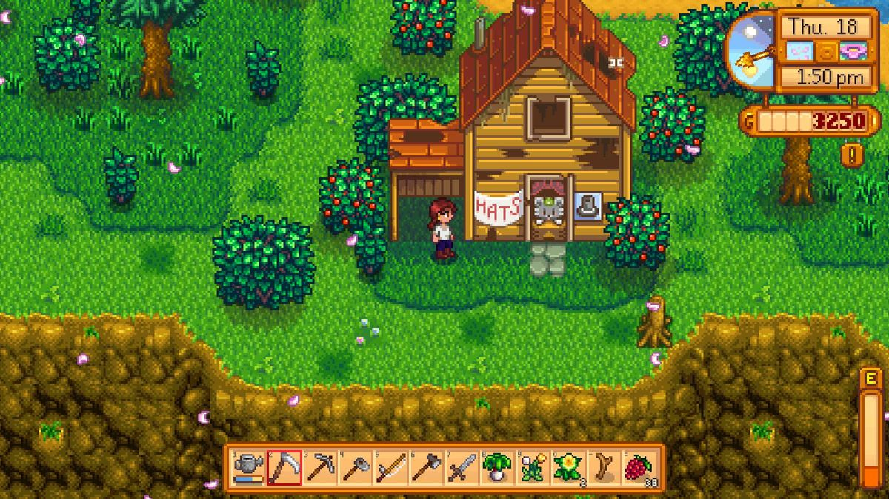
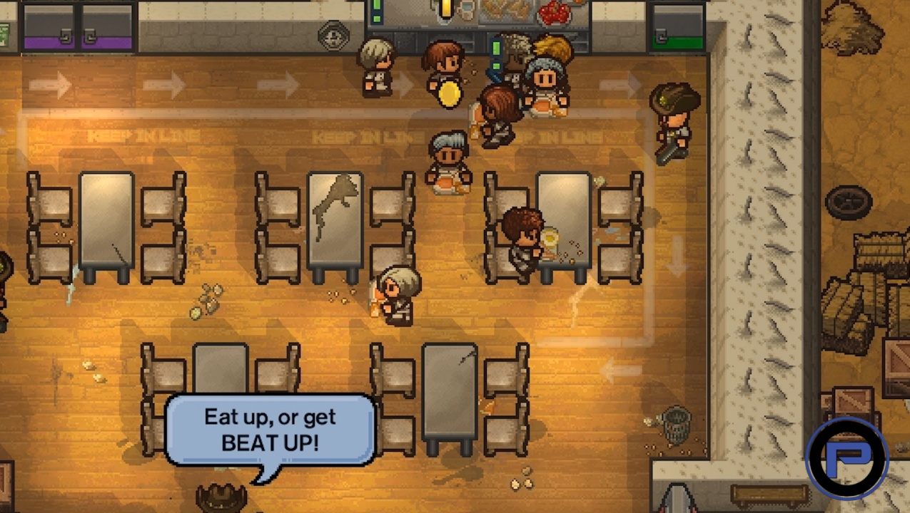
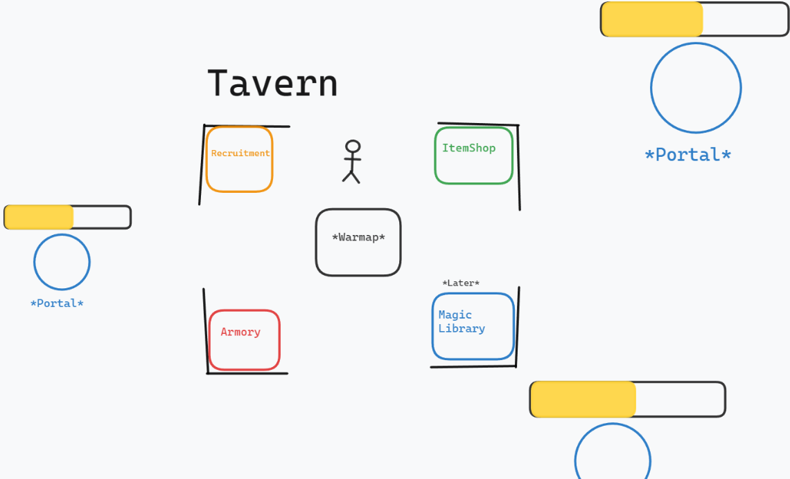
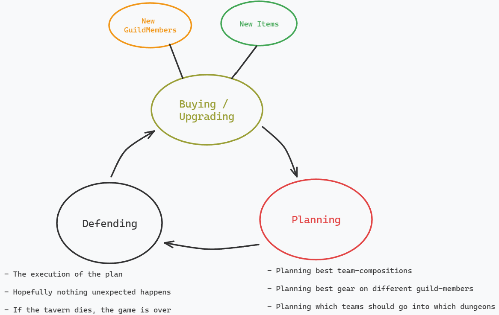

# Guild Master: Pixel Quest - Game Design Document

## Introduction

'Guildmaster for a day' is a top-down pixel-style game where you play as a guildmaster managing a guild tavern in a bustling city. You must recruit and train members for your guild, equip them with gear, and send them to dungeons to fend off monsters threatening the city. As the guildmaster, you'll also need to defend your tavern from invading monsters using armor and weapons.

## Genres

- **Manager Simulation**
- **Strategic RPG**
- **Roguelike**
- **Roundbased**

## Concept

In 'Guildmaster for a day is 'you start off with a very small guild, and will have to strategically manage your resources to grow your guild and protect the guildtavern from invading monsters. The invading monsters will come from dungeons that will spawn at the start of each round. Each with a timer, if the timer runs out, the monsters will attack the guildtavern. The game will be over if the guildtavern is destroyed.

## Target Audience

The average 'Guildmaster for a day' player is a player who enjoys strategic games, and loves to find the optimal way to manage time and set up different strategies for surviving the longest. With a pixelated art style, the game will also focus on the mechanisms of the game, and not the graphics.

## Selling points

- **Strategic Management**: Manage your guild members, gear, and resources to grow your guild and protect the tavern.
- **Dynamic Gameplay Loop**: Balance recruitment, team-making strategy, gear, and magic enhancement ensures that there will be many different ways to play the game.

## Game Design

### Art Style

The game will have a colorful pixel art style, similar to that of the following:

#### Stardew Valley

#### The Escapists 2

### Player Perspective

The player will start in a tavern. Starting off, the player will be able to choose a starting guildmember. The player will be able to move around the tavern, and interact with different stations to manage the guild.

The player will be able to send off guildmembers to dungeons, which will have a chance at granting gold and gear. The player will after the round, be able to spend gold to buy new gear and get new guildmembers.

The player will then have to work as a last line of defense between the guildtavern and the monsters that will attack the tavern if the dungeon timers run out.

---

### Game world

Underneath is a conceptual map of the world.

In the middle of the map is the tavern with the different interactable stations;

- **Recruitment Desk**: Where you can recruit members of different classes (Tank, Mage, Fighter, Healer) with varying stats and abilities.
- **Item Shop**: Purchase gear and items to equip your guild members and yourself.
- **Armory**: Equip yourself and guildmembers with armor and weapons to become stronger.
- **Magic Library**: _TBD_

Outside the tavern, there will be different dungeons that will spawn at the start of each round. Each dungeon will have a timer, and if the timer runs out, the monsters will attack the guildtavern.

---

### Monetization

The game will be a single purchase game, with no in-game purchases.

### Platform, Engine, and Scope

2D game made in Unity built for an Arcade machine for VIA University College. The game is made by a single developer in the span of 2-3 months.

## Gameplay Overview

### Core gameplay loop
Underneath is an illustration of the core gameplay loop

The goal of the player is to get the furthest in the game as possible. The player will have to optimize each of the core components in order to survive the longest.

### Objective and Progression
The objective of the game is to survive as long as possible. The game will have a round-based system, that will get progressively harder as the player progresses. 

Over each round a number of portals will spawn (dungeons) with timers, information about these dungeons will be displayed before the round begins. The player will have to plan and strategize which guildmembers to send to which dungeons, and which gear to equip them with. To hopefully clear the dungeons before the timer runs out.

Clearing the dungeons before the dungeon-timer runs out, will grant the player with gold and gear. The player will then be able to spend the gold on new gear and new guildmembers.

If the player fails to clear the dungeons before the timer runs out, the monsters will attack the guildtavern. The player will then have to fend off the monsters using their own armor and weapons.

### Game Mechanics

#### Recruitment system
The initial recruitment system will be a simple system that will work in allignment with what the player would expect from other RPG titles such as World of Warcraft or other dungeon based RPGs. 

When the player interacts with the recruitment desk, the player will be able to choose between 5 different guildmembers. Each randomly generated with different stats and class. 

The following classes will be available:
- **Tank**:
  - Physical damage: Low
  - Magic damage: Low
  - Vitality: High
- **Mage**: 
  - Physical damage: Low
  - Magic damage: High
  - Vitality: Low
- **Fighter**: 
  - Physical damage: High
  - Magic damage: Low
  - Vitality: Medium
- **Healer**: 
  - Physical damage: Low
  - Magic damage: Medium
  - Vitality: Medium
  - Healing: High

#### Dungeon System
The initial dungeon system will be a simple system that will need to be expanded upon in future iterations of the game.

The dungeons will have a timer. And if the timer rund out, the monsters will exit the dungeon and begin advancing toward to tavern. Where the player will have to fend them off. Otherwise the tavern will take damage and eventually be destroyed. Losing the game.

#### Affix System
The dungeons will have a very simple affix system, where each dungeon will have a random affix that will affect the monsters in the dungeon. The affixes will be displayed to the player before the round begins.

The following affixes will be included in the first iteration of the game: 
- **Quite Clever**: The monsters in this dungeon will take reduced damage from magic attacks.
- **Nails for breakfast** The monsters in this dungeon will take reduced damage from physical attacks.

#### Team system
The dungeons will need to be taken on by a team of guildmembers, and the player will have to choose which guildmembers to send to which dungeons.

The teams will be based off of 5 guildmembers, and it is up to the player how to structure these teams.
(Generally you would like to have a tank, a healer, and 3 damage dealers)

#### Gear and Item System
Gear and items will be a very simple system in the first iteration of the game. The player will be able to buy gear and items from the item shop, and equip them on the guildmembers.

Inside of the armory the player will be able to equip themselves and other guildmembers with armor and weapons to become stronger.

In the first iteration of the game, each guildmember and the main player will be able to equip 1 weapon and 1 armor piece. To increase their damage and vitality respectively.

#### Magic System *(Not implemented in first iteration of the game)*
 

